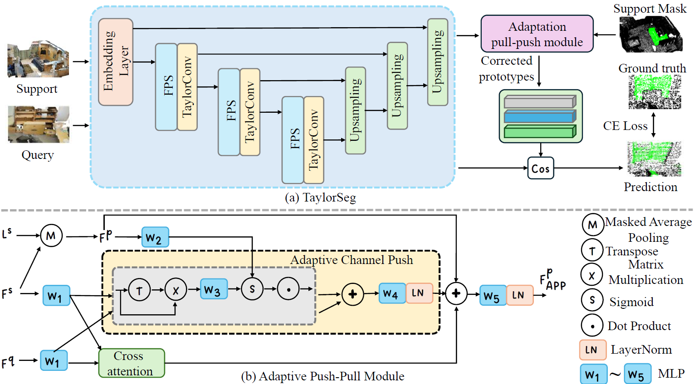

# 🔥Taylor Series-Inspired Local Structure Fitting Network for Few-shot Point Cloud Semantic Segmentation🔥


## 💥 News

- **[2026.02]** 🎉 Our latest work on Few-shot Point Cloud Semantic Segmentation, **[VIP-Seg](https://openreview.net/pdf/22cecc6d0bf0490b04943fcb6f10ba91e1cc396d.pdf)**, has been accepted by **[NeurIPS 2025](https://neurips.cc/Conferences/2025/Dates)**! The **[Code](https://github.com/changshuowang/VIP-Seg_NeurIPS2025/)** is released.
- **[2025.12]** We release the [paper](https://ojs.aaai.org/index.php/AAAI/article/view/32810) and the [code](https://github.com/changshuowang/TaylorSeg).
- **[2024.12]** 📢 [TaylorSeg](https://ojs.aaai.org/index.php/AAAI/article/view/32810) is accepted by [AAAI 2025](https://aaai.org/conference/aaai/aaai-25/) 🎉!

## Introduction
We propose **TaylorSeg**, a **Taylor** series-inspired local structure fitting network for few-shot point cloud semantic **seg**mentation. TaylorSeg introduces two variants: a non-parametric **TaylorSeg-NN** and a parametric **TaylorSeg-PN**. **TaylorSeg-NN** requires no pretraining and achieves competitive results without learnable parameters by modeling local structures as polynomial fitting problems. Building upon this, **TaylorSeg-PN** enhances performance by introducing an **Adaptive Push-Pull (APP)** module, which mitigates feature distribution gaps between query and support sets, leading to better generalization for unseen categories.




## Installation
Create a conda environment and install dependencies:
```bash

conda create -n TaylorSeg python=3.7
conda activate TaylorSeg

# Install the according versions of torch and torchvision
pip install torch==1.13.1+cu117 torchvision==0.14.1+cu117 torchaudio==0.13.1 --extra-index-url https://download.pytorch.org/whl/cu117

pip install pointnet2_ops_lib/.
pip install -r requirements.txt
```

## Datasets

**Data preparation please follow [attMPTI](https://github.com/Na-Z/attMPTI). You can also download directly from [COSeg](https://github.com/ZhaochongAn/COSeg). You need to create a data folder and put the data in that folder.**

## Experiments

We reproduced the experimental results from the paper using an NVIDIA RTX 4090 GPU.

### TaylorSeg-NN 

TaylorSeg-NN does not require any training and can conduct few-shot segmentation directly via:

```bash
bash scripts/segnn_s3dis.sh
or
bash scripts/segnn_scannet.sh
```

### TaylorSeg-PN 

We have released the trained models under [log_s3dis_TaylorSegPN](https://github.com/changshuowang/TaylorSeg/tree/main/log_s3dis_TaylorSegPN) and [log_scannet_TaylorSegPN](https://github.com/changshuowang/TaylorSeg-NN/tree/main/log_scannet_TaylorSegPN) fold. To test our model, direct run:

```bash
bash scripts/segpn_eval_s3dis.sh
or
bash scripts/segpn_eval_scannet.sh
```

Please note that randomness exists during training even though we have set a random seed.

If you want to train our method under the few-shot setting:

```bash
bash scripts/segpn_s3dis.sh
or
bash scripts/segpn_scannet.sh
```

The test procedure has been included in the above training command after validation.


Note that the above scripts are used for 2-way 1-shot on S3DIS (S_0). Please modify the corresponding hyperparameters to conduct experiments in other settings. 


## Acknowledgement
We thank [Seg-NN](https://arxiv.org/pdf/2404.04050.pdf), [Point-NN](https://github.com/ZrrSkywalker/Point-NN/tree/main), [COSeg](https://github.com/ZhaochongAn/COSeg), [PAP-FZS3D](https://github.com/heshuting555/PAP-FZS3D), and [attMPTI](https://github.com/Na-Z/attMPTI).


 ## Citation

If you find this repository useful in your research, please consider giving a star ⭐ and a citation.
```bibtex

@inproceedings{wang2025reasoning,
  title={Reasoning Beyond Points: A Visual Introspective Approach for Few-Shot 3D Segmentation},
  author={Wang, Changshuo and He, Shuting and Fang, Xiang and Hu, Zhijian and Huang, Jia-Hong and Shen, Yixian and Tiwari, Prayag},
  booktitle={The Thirty-ninth Annual Conference on Neural Information Processing Systems},
  year={2025}
}

@inproceedings{wang2025taylor,
  title={Taylor series-inspired local structure fitting network for few-shot point cloud semantic segmentation},
  author={Wang, Changshuo and He, Shuting and Fang, Xiang and Wu, Meiqing and Lam, Siew-Kei and Tiwari, Prayag},
  booktitle={Proceedings of the AAAI Conference on Artificial Intelligence},
  volume={39},
  number={7},
  pages={7527--7535},
  year={2025}
}

```
